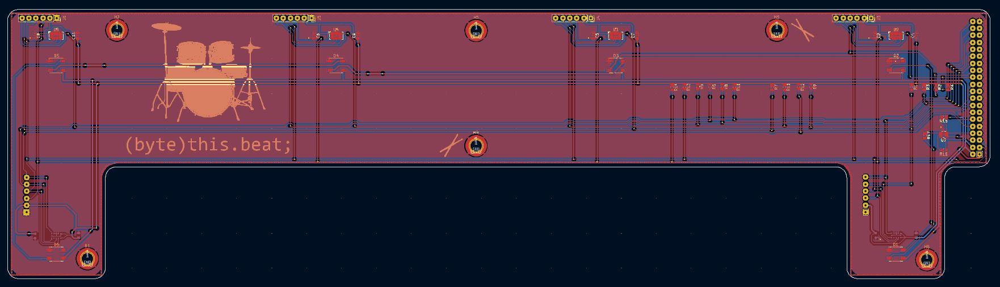
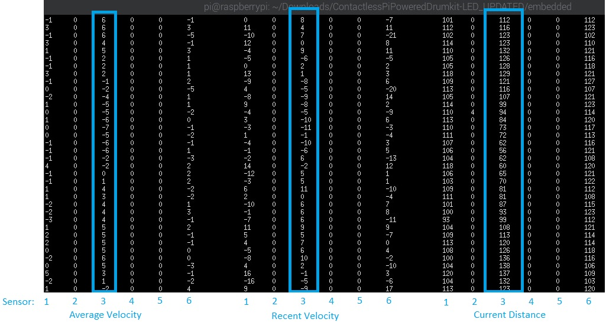
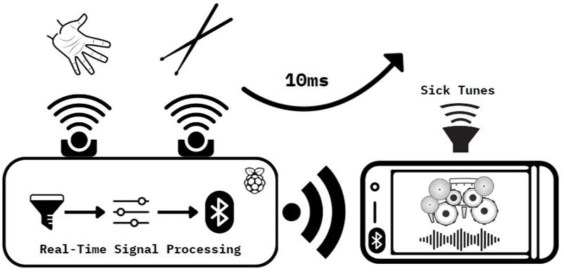
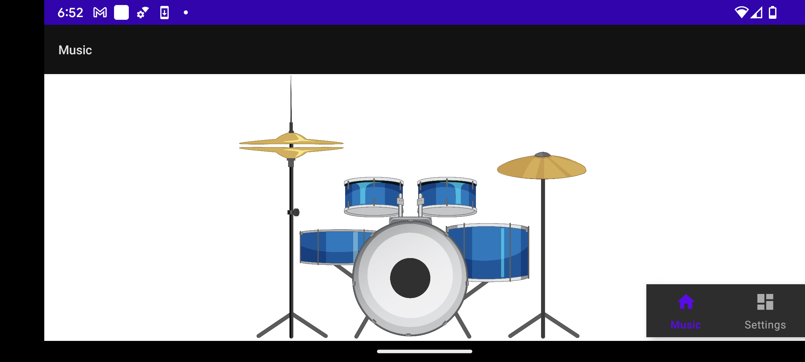

#  (byte)this.beat  
Welcome to the github landing page for the first prototype of the **(byte)this.beat** drumkit!

(byte)this.beat is an innovative, contactless, raspberry pi-powered drumkit being developed for  Real Time Embedded Programming (ENG5220) at the University of Glasgow.  The contactless drumkit aims to be a simple, easy-to-use interface that accommodates entry level users---being a introductory device to jam out on---as well as a device for professional musicians, conforming to sub 20ms latency requirements and high quality, 48000khz drum samples.

Please download the latest release to access the most recent stable version of the source code. Keep in mind that hardware is required to run this project!

## So what's the tempo?

* The challenge set for this course was to develop any real time embedded project, using a Raspberry Pi 3 and a £45 budget.  
* Selecting an appropriate sensor that can be used in a real-time system that is affordable, has a high sample rate, and great data resolution was challenging. After a thorough amount of market research, the [VL53L4CD](https://www.st.com/en/imaging-and-photonics-solutions/vl53l4cd.html) ranging sensor was selected as the most suitable ic for our project. Turning them into "invisible" drum modules so that you can jam out in thin air seemed a perfect task!  
* The distance values measured by the sensors every 10ms are used to calculate the velocity of any objects directly above the sensors. A detection algorithm is derived by being a combination of when the velocity changes direction, and what the previous 80ms of velocity was measured as. Thus, it is possible to use the sensor data to not only detect when a drum hit has been detected, but also at what intensity!

## Team Collaboration and Project Management

Project management was done by utilising a teams channel for collaboration. At the start of our group project, keeping in mind an agile team development environment, a Gantt chart was created in excel and hosted on our teams channel. Our team had two meetings each week throughout the semester; the first of which was primarily for project planning and updates, and the second meeting was for development and one-on-one problem solving, if necessary. Github issues were utilised as a means to give feedback as our project development continued. All Project Discussions, meeting notes, and development feasibility studies can be found at our [sharepoint](https://gla.sharepoint.com/:o:/s/ENG5228RTEP/Er4JzmCRMUZCnUjhNUSQIA8BrX5IVSQI6c456dHyLfZf0w?e=HDqj4z).  
This link is accessible by anyone with a University of Glasgow account. 
GitHub issues were used as a way to track the development of the project. The issues can be viewed from the header of this page, above the directory browser.

## Project Setup and Initialisation
### Hardware Requirements
* Assembled (byte)this.beat board
* Raspberry Pi updated with latest Raspbian image
* Speaker attached to Audio Jack
### Software Setup
* Complete project setup instructions located in the [Embedded Directory](https://github.com/GrantMaiden/ContactlessPiPoweredDrumkit/tree/main/embedded) on your local raspberry pi
* Download the latest release of the firmware, and compile the source code in the embedded directory by following the [cmake build instructions](https://github.com/GrantMaiden/ContactlessPiPoweredDrumkit/blob/main/embedded/cmake_build_instructions.txt)

After running the program, an intro LED pattern will play for roughly 5 seconds, which when complete the drumkit will be able to receive ranging data. To enable sound, swipe across all 4 upwards facing sensors. The same swipe can be used to disable sound if playing needs to be paused.

## Documentation
Our code has been updated with comments that are compatible with DoxyGen, which is a great tool to generate large amounts of sufficiently segmented documentation. To view the generated documentation, first grab the latest release, then open the index.html page located in the [embedded/docs](https://github.com/GrantMaiden/ContactlessPiPoweredDrumkit/tree/main/embedded/docs) directory. In addition to the DoxyGen resource, the source code is litered with verbose explanaitons and function headers, so keep that in mind if you are modifying the source.

## Hardware Development
In order to minimise costs associated with the (byte)this.beat project, a custom Hardware design was developed. After a cost analysis completed at the beginning of the project timeline, it was concluded that designing a custom solution, rather than purchasing independent breakout boards, would allow our contactless drumkit to have a larger scope. Thus accommodating more sensors/functionality by more easily staying within our £45 budget. The discussions pertaining to analysis and cost can be seen at our [onenote](https://gla.sharepoint.com/:o:/s/ENG5228RTEP/Er4JzmCRMUZCnUjhNUSQIA8BrX5IVSQI6c456dHyLfZf0w?e=HDqj4z).  

As always, the goal with any project is to learn as much as possible while designing, thus we decided to use this opportunity to get familiar with KiCad for schematic entry. A prototype design was completed early into the semester, giving our team plenty of tolerance on receiving the fabricated boards. The fabricated board can also easily accommodate many more traces and connections than a breadboard solution could, allowing for the design scope to increase. The schematic can be seen [here](https://github.com/GrantMaiden/ContactlessPiPoweredDrumkit/blob/main/hardware/ContactlessPiPoweredDrumkit/Schematic/byteThisBeatREVA.pdf).

The drumkit had a portion of the budget left over after the primary sensor selection, so we decided to use the rest of the funds on purchasing LEDs that would aid in giving the drummer feedback during hit detection. As seen in the block diagram below, the raspberry pi communicates with 6 distance sensors, outputs to the on-board audio jack, and outputs serialised data to the LEDs.

The LEDs that were chosen are the same type of addressable LEDs that can be found on LED strips. They are affordable, and plenty of options are available. A few design challenges had to be faced regarding the decision to use these leds, however. The LEDs use 5V logic for communication, so a level shifter had to be added to translate the rpi's 3.3V logic to 5V. Secondly, the LEDs use a strict 800khz transmission rate for each bit. Serialised bits need to be given to the LEDs over a single trace, essentially the LEDs act as specialised shift registers, only forwarding their to each succeeding LED after 24bits of data has been received. The data sheet for the LEDs, along with more information regarding the protocol, can be found [here](https://github.com/GrantMaiden/ContactlessPiPoweredDrumkit/blob/main/docs/datasheets/IN-PI55TAT(X)R(X)G(X)B_v1.5.pdf). 

Due to the strict timing requirement of the LEDs, we had to use a hardware bus to send the LED bitstream, given that bitbanging at 800khz would not be consistent, and would cause too much overhead. Initially, the PCB was designed to use the uart interface for driving the LEDs, but after getting the boards in-hand and beginning development, it was found that the uart bus could not support the baudrate required (800khz*(8bits + 1stopbit) = 7.2mhz), a hardware rework was completed to change the LED control over to the SPI bus, which could accommodate the necessary frequency. The rework instructions can be found in the hardware directory.

For more information regarding the manufacturing of the (byte)this.beat board, please refer to the [hardware directory](https://github.com/GrantMaiden/ContactlessPiPoweredDrumkit/tree/main/hardware/ContactlessPiPoweredDrumkit), which includes a BOM for manufacture. The board file can also be seen in this directory. Layout was completed using KiCad, with a two-layer PCB being designed. After meeting with the EE technicians at the University of Glasgow, we found that they were unable to fabricate our design, so an overseas location was chosen for fab and assembly.

## Software 

The embedded code, being the main focus of our project, was approached with several goals for implementation:
* Real Time Coding - code is event driven and utilises hardware inputs or timers to strictly control code behavior
* Event Handling - real time events are coded with clearly defined callbacks and other async operations
* Class Encapsulation - code is written within separate classes that have clear responsibilities, obey the Liskov Substitution Principle, and are segregated, with dependency inversion
* Documentation - Verbose function headers and additional documentation generated with Doxygen to supply the user information
* Header File Constants - many constants included to aid in program control and easily modify behavior

Below, please see a diagram regarding how the major classes interact with each other within our application.

The controller class is initialised by the Main function, which on program boot creates the initial controller class. When the controller class is initialised, it will bring up the other portions of the program, which configures any necessary peripherals, and performs the bring-up procedure of the ranging sensors. This initialisation also configures asynchronous processes that use callback processes to create real-time operation of our system. The LED class uses a timer, and updates all LEDs every 2.5ms. The VL53L4CD class leaves an abstract function that is defined within the Controller class. When a hardware interrupt occurs, the VL53L4CD class will enact a callback via the virtual function.

### Bus Protocols
I2C was used as the communication protocol for each sensor. All sensors share the same bus, but are initialised with the same address. An initialization procedure had to be crafted to disable all sensors on program start, then bring-up each sensor sequentially, reprogramming the I2C bus address for the sensor, and configuring it for our high sample rate requirements.

Note: From VL53L4CD Datasheet

The SPI protocol uses custom bitshift operations to drive 6*24bits of RGB data to our addressable LEDs. The GPIO controller class handles the sending of the SPI data.
### Digital Signal Processing
The outgoing data from the ranging sensors is inherently quite noisy, and lots of artifacts exist especially once you begin to interact with them. In order to have reliable air drumming behavior, it was necessary to come up with multiple algorithms that filter the data in various ways. Keeping in mind the real-time requirements of our system, a lengthy finite reponse filter could not be used due to adding to much delay to the total system overhead. To minimise response delays, filtering was controlled using the following methods, configurable inside the controller.h header file:
* HIT_DETECT_NOISE_CHECKING   -- Enable Noise Checking/Filtering
* HIT_DETECT_NUM_SAMPLES_MIN   -- Minimum number of samples necessary for detection
* DRUM_INTERVAL_TIMEOUT_MS  -- Timeout between detection events. Caps maximum drum rate per drum
* HIT_DETECT_INSTANEOUS_VELOCITY_LIMIT  --  Velocity artificats occur frequently. If one of the detection samples' velocity is above this limit, then the drum detect is cancelled
* HIT_DETECT_AVG_VELOCITY_CEILING -- An average velocity is taken of all previous detection samples. If this average is above this threshold, then the drum detect event is negated
* HIT_DETECT_MIN_SEQUENTIAL_VELOCITY_SAMPLES  --  Minimum number of previous velocity samples below the HIT_DETECT_AVG_VELOCITY_CEILING required for a hit detect
Whenever a sensor receives data, via a virtual callback the data is sent to the controller class for processing. The controller class will take the most recent data, store the last 16 distance values into an array, and calculate the most recent velocity by taking the last sample minus the most recent sample. When the velocity calculation occurs, the velocity data is ran through a simple running average filter, via the calculation: averageVelocity = averageVelocity + (recentVelocity - averageVelocity) / VELOCITY_FACTOR_AVG. The VELOCITY_FACTOR_AVG is a constant modifiable in the controller.h header file.
A running average filter allows for a single sample overhead during averaging, and converges completely to the real average within the VELOCITY_FACTOR_AVERAGE number of samples.
As a brief example of the challenges seen during data collection and processing, refer to the below image. This image shows the Average Velocity, Recent Velocity, and current distance of each sample, in 10ms increments. 
 
## Phone Application
 
Originally, ambitious project planning had our team plan on utilising a phone application to interact with the physical drumkit, using bluetooth to handshake, modify drumkit selections, and use the phone as a speaker. We did have the opportunity to develop a prototype phone app early on in the semester. However, due to team bandwidth limitations, we were unable to see the bluetooth connectivity and phone app through to completion. 
 
It should be noted that we also discovered though substantial literature review that bluetooth bandwidth is relatively inconsistent, and even the bluetooth low latency has minimum latency intervals of about 70ms. We concluded that using bluetooth as a realtime interface would be a nightmare, and it would be best to at least keep to a physical connection regarding the sound output. We still think that a phone app would be a great way to interact with the drumkit settings, volume, etc., any we plan to continue to consider implementing one in the future.
 

## Unit Testing Framework
A custom unit testing framework was designed to accommodate the needs of our team collaborative efforts. When the application launches, the first code that is ran is a search to see if any input arguments are supplied. The input arguments are the inputs to our custom unit testing framework; it was deemed necessary to have a more advanced testing methodology in place as the many different blocks of our project required separate entry points depending on use case. In example, a unit test was designed to benchmark and initialise the LEDs. After the unit test was completed, the functions designed during test were integrated into the rest of the project. This design methodology was enacted in all facets of our software development. 

A list of all unit tests, their associated functions, and more specific usage instructions can be found [here](https://github.com/GrantMaiden/ContactlessPiPoweredDrumkit/blob/main/embedded/unit_tests.txt).

## Challenges and Future Improvements
Development using the raspberry pi proved to be full of challenges. Some of our team has had extensive experience with varying microcontrollers as a professional embedded engineer, and they concluded that the lack of substantial official documentation greatly complicated development. 
Here is a list of (just a few!) of the notable challenges that arose during development:
* Audio permissions -- The pigpio library requires sudo permissions, however the asla audio driver is not configured correctly to run under super user. The solution was challenging to discover, but is highlighted in the markup in our embedded directory.
* SPI bus frequency -- The embedded core clock used by the PI is not consistent. Our addressable LEDs requires fixed timing to work correctly, however the SPI clock is affected by other bus activity, USB traffic, and high load wifi connections. Essenstially, the LEDs will flicker or flash random colors when the SPI frequency deviates. As far as we know, there is no solution to this problem, but it shows that the raspberry pi is full of undocumented surprises, and is not capable of specific timing control under some circumstances.
* Some low level c libraries such as pigpio have functions to modify embedded bus behaviour, but really these values are controlled by the us and it is necessary to modify the /boot/firmware/config.txt to change things such as the I2C clock speed.
* The SPI cs gpio's can not be used as GPIO's during spi, even if SPI0 is being used, and SPI1 CS is trying to be configured as an input, even when all documentation says otherwise. This required a rework!

Some future improvements for the drumkit are planned for the next revision of the project.

* Move away from the high power, large raspberry pi to a smaller mcu. Originally one of the goals of our project was to make a device small and portable; a criteria that our device doesn't quite meet.
* Implement bluetooth communication that will interact with a peripheral phone app for control and feedback.
* Respin the board to correct hardware reworks required to accomodate SPI CS GPIO bottlenecking, and switching to the SPI from UART for LED control.
* Improve hit detection by exploring other filtering methods, and perhaps different sensors.

## Authors

* Grant Maiden  
* Peter O'Hanlon  
* Ethan Travers  
* Lucas Zehner  
