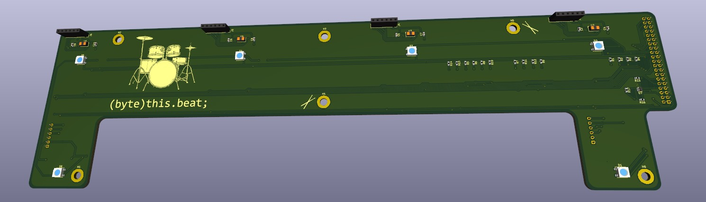

#  byte_theBeat  
byte_theBeat is a contactless, Pi-Powered Drumkit, being developed for the Real Time Embedded Programming course (ENG5228) at the University of Glasgow.  

## So what's the tempo?

The challenge set for this course was to develop any real time embedded project, using a Raspberry Pi 3 and a £50 budget.  
We found these awesome time-of-flight sensors from ST: [VL53L4CD](https://www.st.com/en/imaging-and-photonics-solutions/vl53l4cd.html))  and decided to turn them into "invisible" drum modules so that you can jam out in thin air!  
The distance values measured by the sensors are used to calculate a velocity - which in turn is used for "hit detection", so the timing and intensity of each drum hit can be determined.

## Team docs

All Project Discussions, meeting notes, and development feasibility studies can be found at our [sharepoint](https://gla.sharepoint.com/:o:/s/ENG5228RTEP/Er4JzmCRMUZCnUjhNUSQIA8BrX5IVSQI6c456dHyLfZf0w?e=HDqj4z).  
This link is accessible by anyone with a University of Glasgow account.

## Authors

Grant Maiden  
Peter O'Hanlon  
Ethan Travers  
Lucas Zehner  

## Acknowledgments

